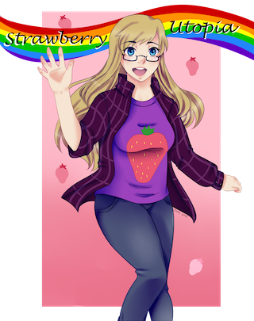
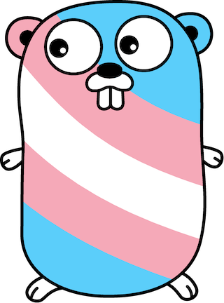
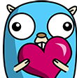
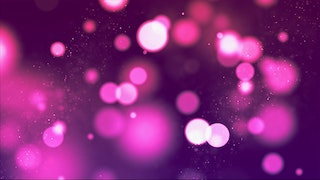
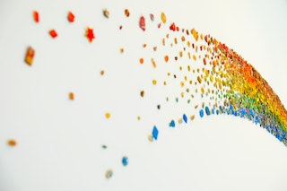

# Credits

All / Most art that I use on [my Twitch channel](https://www.twitch.tv/strawberryutopia/).

If I'm missing anything, or anything is misattributed, please [let me know](https://github.com/strawberryutopia/twitch-credits/issues) :)

## Images

### Picture of Me

By DragonYoukaiKanaChan

Made by a friend of mine, [https://dragonyoukaikanachan.deviantart.com/](DragonYoukaiKanaChan), for me to use as I see fit

### Channel Icon

By Onessa Novak (Nessio)

Made as a commission for me, circa 2009. I use it as my avatar basically everywhere online.

Her DeviantArt (where I found her) is kinda dormant now, but you can check out her Instagram here:

[https://www.instagram.com/onessanovak/](https://www.instagram.com/onessanovak/) 

### Trans Gopher

By me!

Available here: [https://github.com/lucymhdavies/trans-gopher](https://github.com/lucymhdavies/trans-gopher)

The original Go gopher was designed by Renee French. ([http://reneefrench.blogspot.com/](http://reneefrench.blogspot.com/))

This particular gopher design is a modification of an image created I got from keygx:
[https://github.com/keygx/Go-gopher-Vector](https://github.com/keygx/Go-gopher-Vector)

This in turn is a modification of an image by Takuya Ueda ([https://twitter.com/tenntenn](https://twitter.com/tenntenn)):
[https://github.com/golang-samples/gopher-vector/blob/master/README.md#gopher](https://github.com/golang-samples/gopher-vector/blob/master/README.md#gopher)

## Emotes

### Gopher with Heart

By Seraphim Kimiko

Made by [https://www.twitch.tv/seraphimkimiko](https://www.twitch.tv/seraphimkimiko) for me to use as I see fit

The original Go gopher was designed by Renee French. ([http://reneefrench.blogspot.com/](http://reneefrench.blogspot.com/))

## Backgrounds

### Purple Bokeh

By Pixabay - [https://www.pexels.com/@pixabay](https://www.pexels.com/@pixabay)

Available here: [https://www.pexels.com/photo/abstract-art-background-blur-220072/](https://www.pexels.com/photo/abstract-art-background-blur-220072/)

CC0 License
Free for personal use and commercial use
Attribution not required, but appreciated

### Blue, Green, Orange and Red Rainbow Design Decoration

By Francesco Ungaro - [https://www.pexels.com/@francesco-ungaro](https://www.pexels.com/@francesco-ungaro)

Available here: [https://www.pexels.com/photo/blue-green-orange-and-red-rainbow-design-decoration-673648/](https://www.pexels.com/photo/blue-green-orange-and-red-rainbow-design-decoration-673648/)

CC0 License
Free for personal use and commercial use
Attribution not required, but appreciated

## Fonts

### Montauk

By Miglena Spasova - [https://creativemarket.com/creativityrush](https://creativemarket.com/creativityrush)

Available here: [https://creativemarket.com/creativityrush/2285373-20-OFF-Montauk-Sans-Serif-Family](https://creativemarket.com/creativityrush/2285373-20-OFF-Montauk-Sans-Serif-Family)

Creative Market Standard License (Installable Items)
[https://creativemarket.com/licenses](https://creativemarket.com/licenses)
Commercial Use - Unlimited Projects
Attribution not required, but appreciated

### 04b 30 Font

By Yuji Oshimoto - [http://www.04.jp.org/](http://www.04.jp.org/)

Available here: [https://www.dafont.com/04b-30.font](https://www.dafont.com/04b-30.font)

License:
[http://www.dsg4.com/04/extra/bitmap/about.html](http://www.dsg4.com/04/extra/bitmap/about.html)

> * These fonts are freeware.
> * Distribution, transfer, and reprint for non-commercial purposes are free, but we are strictly prohibited to sell them without the author's permission or attach to commercial products.

In my usage (as headers for the widgets on my Channel page), I think that's okay for now.

## Music

Intro / AFK / Ending music

In-stream music is (usually) from http://pretzel.rocks, and will be attributed in Twitch chat as it is playing

### Powerup!

Powerup! - Jeremy Blake

Usually used as my Intro music

[https://soundcloud.com/jeremyblake/powerup](https://soundcloud.com/jeremyblake/powerup)

Also available on YouTube Audio Library

### Howling

Howling - Lupus Nocte

[Epidemic Sound](https://www.epidemicsound.com/search/?search_query=howling%20lupus%20nocte)

### Safety Net
by Riot

[https://www.youtube.com/watch?v=faEtFGEqEAo](https://www.youtube.com/watch?v=faEtFGEqEAo)

Also available on YouTube Audio Library

### AI 2
by Vibe Mountain

[https://www.youtube.com/watch?v=lJvZqB-2T54](https://www.youtube.com/watch?v=lJvZqB-2T54)

Also available on YouTube Audio Library

